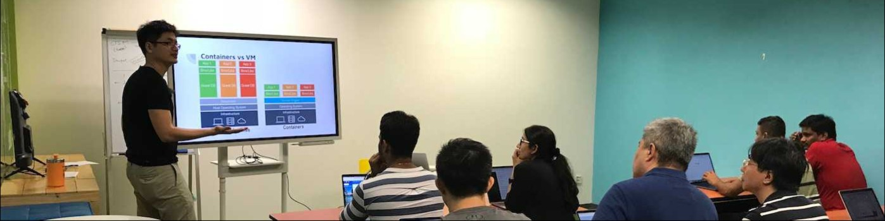
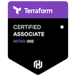
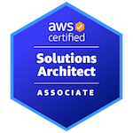

## Hi there 👋 I'm Moses Liao

I am a backend server developer, DevOps and SRE Engineer, and cloud architect

Services have to be secure and reliable, hence you find my interest in a cloud architect and site reliability engineering. I ensure SLA by doing load testing and deploying monitoring tools on apps to make sure anything that can bring the servers down will be pick up by me or someone similar to me first.

- 🔭 I’m currently working on ...

    * a special grafana proxy to cache search results so that it gets displayed quickly. The targetted database is splunk, with the hope it can expand to other different source or form of database soon.

- 🌱 I’m currently learning ...
    * Microsoft Azure infrastructure, to complement with my AWS solution architect certificate

- 👯 I’m looking to collaborate on ...
    * Plug and play data sources for chatGPT like AI, where the data can be quickly learned and be put forward as useful information when someone wants to search for something.

- 🤔 I’m looking for help with ...
    * Understanding ChatGPT or similar AI that can help on the above work.

📫 How to reach me: ...

### Language and tools

### Certification

<!--
**mosesliao/mosesliao** is a ✨ _special_ ✨ repository because its `README.md` (this file) appears on your GitHub profile.

Here are some ideas to get you started:

- 🔭 I’m currently working on ...
- 🌱 I’m currently learning ...
- 👯 I’m looking to collaborate on ...
- 🤔 I’m looking for help with ...
- 💬 Ask me about ...
- 📫 How to reach me: ...
- 😄 Pronouns: ...
- ⚡ Fun fact: ...
-->
