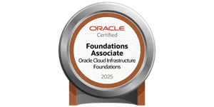
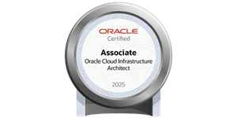

## Hi there 👋 I'm Moses Liao

*Teaching Containers vs VMs — Singapore*

Backend developer, SRE, and cloud architect in Singapore. I keep production services secure and reliable: load testing, monitoring, and the kind of observability that catches an outage before your users do.

Right now I'm pointing AI at a problem I keep hitting — **old, messy databases nobody wants to touch.** I'm working toward a DBA in Emerging Technologies at Golden Gate University and building the tooling in the open.

- 👯 **Looking to collaborate on** — using AI to clean up legacy databases. If that's your problem too, get in touch.
- 💬 **Ask me about** — SRE, Kubernetes, load testing at scale, air-gapped datacenters, or getting an LLM to talk to your data.

### Selected work

| Project | What it is | |
|---|---|---|
| [postgres-mcp](https://github.com/mosesliao/postgres-mcp) | Read-only MCP server that lets an AI model query PostgreSQL in plain English |  |
| [local-kb-llm](https://github.com/mosesliao/local-kb-llm) | Fully local RAG stack — Ollama + ChromaDB + LangChain. No data leaves your machine |  |
| [kubernetes-locust](https://github.com/mosesliao/kubernetes-locust) | Distributed load testing with Locust on AWS EKS |  |
| [fastlane-plugin-lizard](https://github.com/mosesliao/fastlane-plugin-lizard) | Official fastlane plugin for lizard code-complexity analytics |  |

📫 **How to reach me**

Open to consulting on SRE, cloud architecture, and AI-over-your-data projects.

### Language and tools

**Cloud & infra**

**Languages**

**Ops & data**

### Certification

